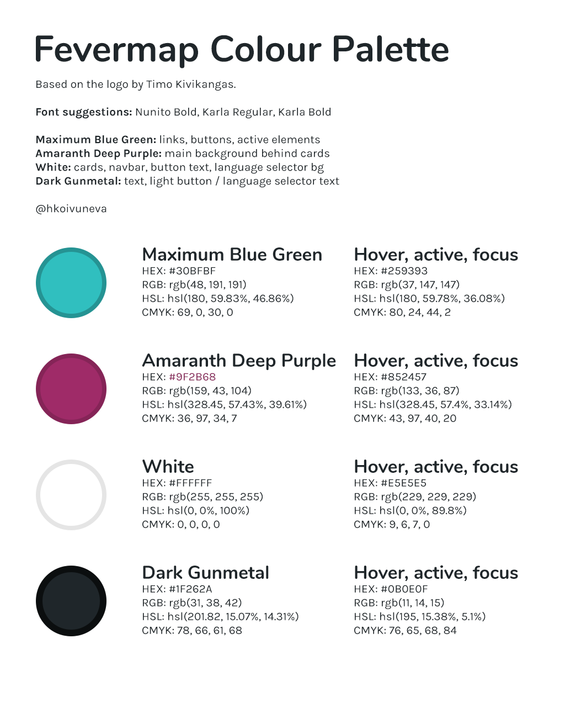

# Fevermap branding guidelines and material

## Fevermap official spelling and tagline

The official spelling is **Fevermap**. In logo the spelling is all in capitals: FEVERMAP.

The official tagline is **Infection tracking**. As such it is not identifiable, so it should be used with the Fevermap name.

## Fevermap official colors
The official color palette:

The color palette is available in [pdf](images/palette/ColourPaletteFonts.pdf).
And in [SCSS](images/palette/palette.scss).

The basic usage of the colors:

**Maximum Blue Green**: links, buttons, active elements

**Amaranth Deep Purple**: main background behind cards

**White**: cards, navbar, button text, language selector bg

**Dark Gunmetal**: text, light button / language selector text

## Fevermap official fonts
The official fonts: **Nunito Bold, Karla Regular, Karla Bold**

## Fevermap official logo

The official logo in svg:

Logo with tagline in svg:

## Fevermap official icons

The official icon in svg:

The official inverted round icon in svg:

Icons in different png sizes can be found [here](app/src/assets/images/).

## Fevermap official cover images

The official cover images with and without the name and tagline:

