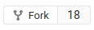
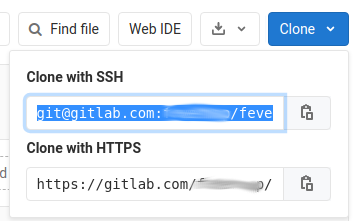
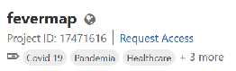

# Contributing to Fevermap

We welcome all sorts of contributions:

- Testing the development version at https://dev.fevermap.net and submitting bug reports.
- Filing new issues about new ideas, or enriching existing issues with comments, data and insight to get turn ideas into reality.
- Making new translations or updating existing ones.
- Proof-reading, all kind of spell checking and efforts to ensure our texts are crisp and documentation up-to-date.
- Contacting new potential participants and helping them learn about the project and get involved.
- Contacting governments, municipalities and health authorities to get the involved.
- All sorts of community management and facilitating that advances the project.
- Making visual designs and graphic material for coders to consume.
- Making front-end code improvements (HTML/CSS/JS)
- Making back-end code improvements (Python)
- Making infrastructure improvements (shell scripts, Docker, security)

As you can see, coding is just one of the ways to contribute. If you don't know where to begin, start out with something small and dive deeper later :)

Most of the collaboration is done over Gitlab, so learning the basics of Gitlab is required. At a minimum you must have a Gitlab account to be able to comment the issues.

> NOTE! Please use the search feature at https://gitlab.com/fevermap/fevermap/-/issues to check if the issue you are about to report is already reported, or discussed in some existing issue. We already have quite many things covered, so check existing issues before jumping to make new ones. Thank you for your diligence!

## How to make a Merge Request

The most elementary form of producing tangible things together is via Merge Requests. Our website, our logo and other visual assets, translation, text and the app code itself all reside in the code repository you are now browsing.

For those who are new to Merge Requests, here is a basic walk-through on how to make one.

1. Start with getting an [account on Gitlab](https://gitlab.com/users/sign_up) if you don't have one already.
2. On the [Fevermap repository main page](https://gitlab.com/fevermap/fevermap), click "Fork" to make a copy our our repository under your own Gitlab account editing. 
3. Go to your own repository page (eg. `gitlab.com/<username>/fevermap`), click "Clone" and copy the SSH variant of the address, which you will need to make a local copy. 
4. Open a terminal on your own computer and paste the address into the git command (requires you have [git](https://git-scm.com/) installed) so it looks like something similar to this: `git clone git@gitlab.com:<username>/fevermap.git`. This will create a folder called `fevermap` on your own computer.
5. Enter the folder with `cd fevermap` so you can run `git` commands in it. Make a branch with a descriptive title. Example: `git checkout -b typofix/finnish-translation`. Using git branches will make later changes easier down the road.
6. Open any of the files with a plain-text editor. There are many options, one of the most popular ones is [Atom editor](https://atom.io/), but a simple Notepad type of app will also do. Do find the file and make the changes you want in the text editor. For example translation files are in directory [app/src/assets/language/](app/src/assets/language/). Edit the files you want to change.
7. Once done, save changes to version control and commit with `git commit -a`. In the text editor that opens, write a git commit message. An example could be "Fix typo in Finnish translation". Exit the text editor and the commit is made. You can inspect your commit with `git show` and `git log`. Graphical tools like `git citool` makes commit writing much easier, and `gitk --all` makes history browsing much easier, but those tools are not installed in the standard git installation.
8. Push the new branch with a new commit you made to your own Gitlab account so the change is made public. Pushing is don with `git push`. If it is a completely new branch, you need to set the upstream on the first push, e.g. `git push --set-upstream origin typofix/finnish-translation`, but after that it's just `git push` all the time for that branch.
9. Open the [Fevermap Merge Request page](https://gitlab.com/fevermap/fevermap/-/merge_requests) and click "New merge request", update the description if it wasn't automatically correct, and hit "Save" to file the merge request. Then your code is on the way into into Fevermap officially!
10. After filing a Merge Request just wait patiently for review. It can take a couple of hours or days. From the review you will either get some comments or your change will be accepted as-is.
11. Enjoy the results!

### Rebasing a merge request

> NOTE!: This is very technical, only for coders.

Sometimes you might be asked to rebase on the latest upstream master for various reasons. Here are the steps how to do it:

```
# Initially you most likely just had your own fork cloned locally
$ git remote -v
origin	git@gitlab.com:<username>/fevermap.git (fetch)
origin	git@gitlab.com:<username>/fevermap.git (push)

# Add the upstream master as a new remote called 'upstream'
$ git remote add upstream https://gitlab.com/fevermap/fevermap.git
$ git remote -v
origin	git@gitlab.com:<username>/fevermap.git (fetch)
origin	git@gitlab.com:<username>/fevermap.git (push)
upstream	https://gitlab.com/fevermap/fevermap.git (fetch)
upstream	https://gitlab.com/fevermap/fevermap.git (push)

# Fetch latest master from upstream so your local git is aware of it
$ git fetch upstream master
remote: Enumerating objects: 5, done.
remote: Counting objects: 100% (5/5), done.
remote: Compressing objects: 100% (3/3), done.
remote: Total 3 (delta 2), reused 0 (delta 0), pack-reused 0
Unpacking objects: 100% (3/3), done.
From https://gitlab.com/fevermap/fevermap
 * branch            master     -> FETCH_HEAD
 * [new branch]      master     -> upstream/master

# Rebase your local master on the upstream master
# Use interactive mode so you can easily reword, squash, fixup or drop commits
# to make git history clean and the merge request easy to review.
$ git rebase -i upstream/master
Successfully rebased and updated refs/heads/master.

# Push your new master on Gitlab servers. The merge request you made from your
# own master branch to the upstream master branch will automatically update.
$ git push -f
Counting objects: 6, done.
Delta compression using up to 8 threads.
Compressing objects: 100% (5/5), done.
Writing objects: 100% (6/6), 924 bytes | 462.00 KiB/s, done.
Total 6 (delta 3), reused 0 (delta 0)
To gitlab.com:<username>/fevermap.git
 + 3b3c261...c1e18c2 master -> master (forced update)
```

If you get this error:
```
remote: GitLab: You are not allowed to force push code to a protected branch on this project.
To gitlab.com:<username>/fevermap.git
 ! [remote rejected] master -> master (pre-receive hook declined)
error: failed to push some refs to 'git@gitlab.com:<username>/fevermap.git'
```

Then you can fix it by opening `https://gitlab.com/<username>/fevermap/-/settings/repository#js-protected-branches-settings` and click "unprotect", and try again `git push -f`. This is a bit of a hassle, but something that needs to be done if you used the master branch to make your merge request instead of a separate feature/bugfix branch. If you did step 5 in "How to make a merge request" you will not run into this problem.

See also: https://git-scm.com/book/en/v2/Git-Branching-Rebasing

## Developing on the front-end

Fevermap front end uses [prettier](https://prettier.io/) to format the code, and [eslint](https://eslint.org/) to lint the code.

ESLint performs automated scans of your JavaScript files for common syntax and style errors

Prettier scans your files for style issues and automatically reformats your code to ensure consistent rules are being followed for indentation, spacing, semicolons, single quotes vs double quotes, etc.


#### How to setup prettier

Prettier is installed as a development dependency when running `npm install`. You can run prettier manually by running the command `npm run format:prettier` in the `app` directory.
However a best practice would be to always run it in conjunction with `eslint`. This can be done with the command `npm run format`.

Prettier can be set to run on save, making it really easy to follow the coding style of the project, since the editor will format the code for you as you save the file.

[How to run prettier on your editor](https://prettier.io/docs/en/editors.html)


#### Before you commit

When developing on the front end, before you commit your changes you should always run `npm run check` which will run both `prettier`, and `eslint` in conjunction, making sure the code style matches with the configuration set up for the project.

## How to plan and implement something

If you are doing something small, just plan it, just implement it directly and file a Merge Request to get it reviewed. However, if you plan to do something bigger, it might make sense to file an issue about it, plan ahead what to do in the issue and wait for comments on the idea, and only then start implementing it.

If you are working on an issue, please assign it to yourself, so people can see in the issue and in the [board](https://gitlab.com/fevermap/fevermap/-/boards) that you are working on it.

### Join the project on Gitlab

To open an issue, to comment on an issue or to make a Merge Request you just need a Gitlab account, you don't need to have any special role in the project you are contributing to.

However, to be able to assign an issue to yourself, you need to join the project to be in the pool of users that can be assigned. To join the project, go to the [Fevermap repository main page](https://gitlab.com/fevermap/fevermap) and click "Request access." 

## How to run a local development environment

If you have front-end skills (HTML/CSS/JS) you can easily contribute to the Fevermap app. If you have Python skills, you can help with the API server. In both cases you will benefit greatly from running the local development environment, based on Docker containers.

Local development makes things smooth, since every time you make a change and save a code file, the servers will automatically restart and the browser window will automatically reload, so you always see the latest version of your changes.

To spin up a local development environment, simply run `docker-compose up --build` in the project root.

## Testing and deployment

Please read the [Makefile](../Makefile) and [.gitlab-ci.yml](../.gitlab-ci.yml) contents to see how you run local tests and how our CI system runs tests and deploys each master commit on our test server.
